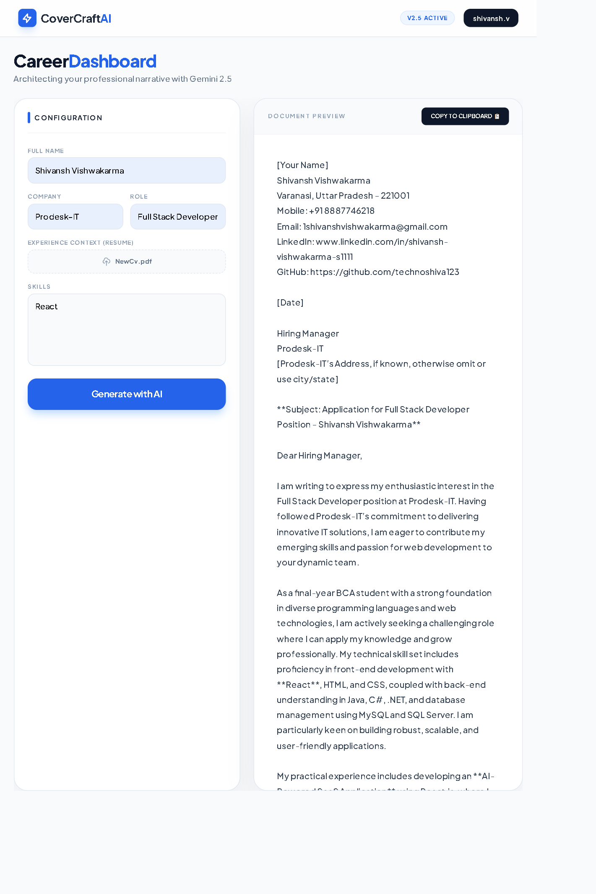

# 📝 CoverCraft AI | Gemini 2.5 Powered Suite
A high-precision career automation tool that architects professional cover letters by merging real-time PDF data extraction with Google’s Generative AI.

## 📸 Preview

## 📺 Project Demo

## 🚀 Features
- 🤖 **AI-Driven Personalization:** Generates context-aware cover letters using the **Gemini 2.5 Flash** (Optimized) architecture.
- 📄 **Deep PDF Parsing:** Integrated `pdf-parse-fork` for high-fidelity text extraction from candidate resumes.
- ⚡ **Dynamic Processing:** Real-time analysis of user skills, role requirements, and company profiles to create tailored narratives.
- 🌌 **Glassmorphism Interface:** A premium, responsive "Career Dashboard" UI with shimmering loading states and modern typography.
- 📋 **Clipboard Integration:** Instant one-click export functionality for rapid job application workflows.
- 🛡️ **Fail-Safe Logic:** Advanced 404 error handling and API versioning (v1) to ensure zero-downtime performance.

## 🛠️ Tech Stack
- 💻 **Core:** HTML5, Tailwind CSS (Utility-First Styling), Vanilla JavaScript (ES6+).
- ⚙️ **Backend:** Node.js, Express.js (REST API Architecture).
- 🧠 **AI Engine:** Google Generative AI SDK (Gemini 2.5 Flash Interface).
- 📁 **Handling:** Multer for memory-stream file handling and `pdf-parse-fork` for buffer parsing.
- 🔧 **DevOps:** Dotenv for secure environment variable management.

## 📂 Project Structure
- `index.html` — Glassmorphism Frontend Dashboard
- `server.js` — Express Backend & Gemini Configuration
- `script.js` — Frontend Logic & API Fetching
- `style.css` — Custom Animations & UI Theme
- `.env` — Secure API Key Storage

## ⚙️ How I Handled the API Error
One of the key technical milestones in this project was resolving a **404 Model Not Found** error. This was handled by:
1. **API Versioning:** Forcing the SDK to use the `v1` endpoint instead of `v1beta` to ensure compatibility with the latest Google Generative AI updates.
2. **Model Alignment:** Re-configuring the model string to `gemini-2.5-flash` to match specific API key permissions and regional availability.
3. **Buffer Management:** Solving the `ERR_PACKAGE_PATH_NOT_EXPORTED` error by utilizing direct internal library calls for PDF parsing, ensuring stability on Node.js v20+.

